# 古典密码合集

Author: [doyo](https://github.com/doyo2024)

本合集会对大多数常见的古典密码做一个简单的介绍。

## 字母序与进制

最简单的一种编码方式，即按照字母表顺序对字母进行编号。除了常见的十进制之外，也可能采用二进制、三进制等进制。

| 字母 | 十进制 | 二进制 | 三进制 | 字母 | 十进制 | 二进制 | 三进制 |
| :---: | :---: | :---: | :---: | :---: | :---: | :---: | :---: |
| A | 1 | 00001 | 001 | N | 14 | 01110 | 112 |
| B | 2 | 00010 | 002 | O | 15 | 01111 | 120 |
| C | 3 | 00011 | 010 | P | 16 | 10000 | 121 |
| D | 4 | 00100 | 011 | Q | 17 | 10001 | 122 |
| E | 5 | 00101 | 012 | R | 18 | 10010 | 200 |
| F | 6 | 00110 | 020 | S | 19 | 10011 | 201 |
| G | 7 | 00111 | 021 | T | 20 | 10100 | 202 |
| H | 8 | 01000 | 022 | U | 21 | 10101 | 210 |
| I | 9 | 01001 | 100 | V | 22 | 10110 | 211 |
| J | 10 | 01010 | 101 | W | 23 | 10111 | 212 |
| K | 11 | 01011 | 102 | X | 24 | 11000 | 220 |
| L | 12 | 01100 | 110 | Y | 25 | 11001 | 221 |
| M | 13 | 01101 | 111 | Z | 26 | 11010 | 222 |

## ASCII码

ASCII码是计算机中常用的一种编码，共计128种字符。如果题目中出现七位或八位的二进制编码，或者有RGB色值出现（因为RGB色值取值范围0~255，与ASCII码范围相仿），那么很可能使用的就是ASCII码。

| 二进制 | 八进制 | 十进制 | 十六进制 | 字符 | 
| :---: | :---: | :---: | :---: | :---: |
| 0000 0000 |  00  | 0  | 0x00 | 空字符 |
| 0000 0001 |  01  | 1  | 0x01 | 标题开始 |
| 0000 0010 |  02  | 2  | 0x02 | 正文开始 |
| 0000 0011 |  03  | 3  | 0x03 | 正文结束 |
| 0000 0100 |  04  | 4  | 0x04 | 传输结束 |
| 0000 0101 |  05  | 5  | 0x05 | 请求 |
| 0000 0110 |  06  | 6  | 0x06 | 收到通知 |
| 0000 0111 |  07  | 7  | 0x07 | 响铃 |
| 0000 1000 |  010 | 8  | 0x08 | 退格 | 
| 0000 1001 |  011 | 9  | 0x09 | 水平制表符 |
| 0000 1010 |  012 | 10 | 0x0a | 换行 | 
| 0000 1011 |  013 | 11 | 0x0b | 垂直制表符 |
| 0000 1100 |  014 | 12 | 0x0c | 换页 |
| 0000 1101 |  015 | 13 | 0x0d | 回车 |
| 0000 1110 |  016 | 14 | 0x0e | 不用切换 |
| 0000 1111 |  017 | 15 | 0x0f | 启用切换 |
| 0001 0000 |  020 | 16 | 0x10 | 数据链路转义 |
| 0001 0001 |  021 | 17 | 0x11 | 设备控制1 | 
| 0001 0010 |  022 | 18 | 0x12 | 设备控制2 | 
| 0001 0011 |  023 | 19 | 0x13 | 设备控制3 | 
| 0001 0100 |  024 | 20 | 0x14 | 设备控制4 | 
| 0001 0101 |  025 | 21 | 0x15 | 拒绝接收 | 
| 0001 0110 |  026 | 22 | 0x16 | 同步空闲 | 
| 0001 0111 |  027 | 23 | 0x17 | 结束传输块 | 
| 0001 1000 |  030 | 24 | 0x18 | 取消 | 
| 0001 1001 |  031 | 25 | 0x19 | 媒介结束 | 
| 0001 1010 |  032 | 26 | 0x1a | 代替 | 
| 0001 1011 |  033 | 27 | 0x1b | 换码(溢出) |
| 0001 1100 |  034 | 28 | 0x1c | 文件分隔符 |
| 0001 1101 |  035 | 29 | 0x1d | 分组符 |
| 0001 1110 |  036 | 30 | 0x1e | 记录分隔符 |
| 0001 1111 |  037 | 31 | 0x1f | 单元分隔符 |
| 0010 0000 |  040 | 32 | 0x20 | 空格 | 
| 0010 0001 |  041 | 33 | 0x21 | ! |
| 0010 0010 |  042 | 34 | 0x22 | " |
| 0010 0011 |  043 | 35 | 0x23 | # |
| 0010 0100 |  044 | 36 | 0x24 | $ |
| 0010 0101 |  045 | 37 | 0x25 | % |
| 0010 0110 |  046 | 38 | 0x26 | & |
| 0010 0111 |  047 | 39 | 0x27 | ' |
| 0010 1000 |  050 | 40 | 0x28 | ( |
| 0010 1001 |  051 | 41 | 0x29 | ) |
| 0010 1010 |  052 | 42 | 0x2a | * |
| 0010 1011 |  053 | 43 | 0x2b | + |
| 0010 1100 |  054 | 44 | 0x2c | , |
| 0010 1101 |  055 | 45 | 0x2d | - |
| 0010 1110 |  056 | 46 | 0x2e | . |
| 0010 1111 |  057 | 47 | 0x2f | / |
| 0011 0000 |  060 | 48 | 0x30 | 0 |
| 0011 0001 |  061 | 49 | 0x31 | 1 |
| 0011 0010 |  062 | 50 | 0x32 | 2 |
| 0011 0011 |  063 | 51 | 0x33 | 3 |
| 0011 0100 |  064 | 52 | 0x34 | 4 |
| 0011 0101 |  065 | 53 | 0x35 | 5 |
| 0011 0110 |  066 | 54 | 0x36 | 6 |
| 0011 0111 |  067 | 55 | 0x37 | 7 |
| 0011 1000 |  070 | 56 | 0x38 | 8 |
| 0011 1001 |  071 | 57 | 0x39 | 9 |
| 0011 1010 |  072 | 58 | 0x3a | : |
| 0011 1011 |  073 | 59 | 0x3b | ; |
| 0011 1100 |  074 | 60 | 0x3c | < |
| 0011 1101 |  075 | 61 | 0x3d | = |
| 0011 1110 |  076 | 62 | 0x3e | > |
| 0011 1111 |  077 | 63 | 0x3f | ? |
| 0100 0000 | 0100 | 64 | 0x40 | @ |
| 0100 0001 | 0101 | 65 | 0x41 | A |
| 0100 0010 | 0102 | 66 | 0x42 | B |
| 0100 0011 | 0103 | 67 | 0x43 | C |
| 0100 0100 | 0104 | 68 | 0x44 | D |
| 0100 0101 | 0105 | 69 | 0x45 | E |
| 0100 0110 | 0106 | 70 | 0x46 | F |
| 0100 0111 | 0107 | 71 | 0x47 | G |
| 0100 1000 | 0110 | 72 | 0x48 | H |
| 0100 1001 | 0111 | 73 | 0x49 | I |
| 0100 1010 | 0112 | 74 | 0x4a | J |
| 0100 1011 | 0113 | 75 | 0x4b | K |
| 0100 1100 | 0114 | 76 | 0x4c | L |
| 0100 1101 | 0115 | 77 | 0x4d | M |
| 0100 1110 | 0116 | 78 | 0x4e | N |
| 0100 1111 | 0117 | 79 | 0x4f | O |
| 0101 0000 | 0120 | 80 | 0x50 | P |
| 0101 0001 | 0121 | 81 | 0x51 | Q |
| 0101 0010 | 0122 | 82 | 0x52 | R |
| 0101 0011 | 0123 | 83 | 0x53 | S |
| 0101 0100 | 0124 | 84 | 0x54 | T |
| 0101 0101 | 0125 | 85 | 0x55 | U |
| 0101 0110 | 0126 | 86 | 0x56 | V |
| 0101 0111 | 0127 | 87 | 0x57 | W |
| 0101 1000 | 0130 | 88 | 0x58 | X |
| 0101 1001 | 0131 | 89 | 0x59 | Y |
| 0101 1010 | 0132 | 90 | 0x5a | Z |
| 0101 1011 | 0133 | 91 | 0x5b | [ |
| 0101 1100 | 0134 | 92 | 0x5c | \ |
| 0101 1101 | 0135 | 93 | 0x5d | ] |
| 0101 1110 | 0136 | 94 | 0x5e | ^ |
| 0101 1111 | 0137 | 95 | 0x5f | _ |
| 0110 0000 | 0140 | 96 | 0x60 | ` |
| 0110 0001 | 0141 | 97 | 0x61 | a |
| 0110 0010 | 0142 | 98 | 0x62 | b |
| 0110 0011 | 0143 | 99 | 0x63 | c |
| 0110 0100 | 0144 | 100 | 0x64 | d |
| 0110 0101 | 0145 | 101 | 0x65 | e |
| 0110 0110 | 0146 | 102 | 0x66 | f |
| 0110 0111 | 0147 | 103 | 0x67 | g |
| 0110 1000 | 0150 | 104 | 0x68 | h |
| 0110 1001 | 0151 | 105 | 0x69 | i |
| 0110 1010 | 0152 | 106 | 0x6a | j |
| 0110 1011 | 0153 | 107 | 0x6b | k |
| 0110 1100 | 0154 | 108 | 0x6c | l |
| 0110 1101 | 0155 | 109 | 0x6d | m |
| 0110 1110 | 0156 | 110 | 0x6e | n |
| 0110 1111 | 0157 | 111 | 0x6f | o |
| 0111 0000 | 0160 | 112 | 0x70 | p |
| 0111 0001 | 0161 | 113 | 0x71 | q |
| 0111 0010 | 0162 | 114 | 0x72 | r |
| 0111 0011 | 0163 | 115 | 0x73 | s |
| 0111 0100 | 0164 | 116 | 0x74 | t |
| 0111 0101 | 0165 | 117 | 0x75 | u |
| 0111 0110 | 0166 | 118 | 0x76 | v |
| 0111 0111 | 0167 | 119 | 0x77 | w |
| 0111 1000 | 0170 | 120 | 0x78 | x |
| 0111 1001 | 0171 | 121 | 0x79 | y |
| 0111 1010 | 0172 | 122 | 0x7a | z |
| 0111 1011 | 0173 | 123 | 0x7b | { |
| 0111 1100 | 0174 | 124 | 0x7c | | |
| 0111 1101 | 0175 | 125 | 0x7d | } |
| 0111 1110 | 0176 | 126 | 0x7e | ~ |
| 0111 1111 | 0177 | 127 | 0x7f | 删除 |

## 摩斯电码（Morse Code）

非常经典的一种编码，也是一种很好伪装的编码。如果出现“嘀嗒”或者很明显的长短交错出现的图案或者两种交替出现的字符，那就很有可能是摩斯电码。也常用于音频题目中。

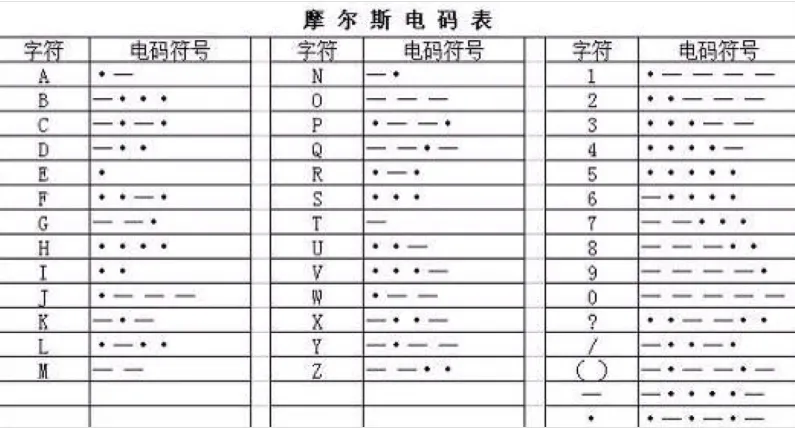

## 旗语

旗语有两种。

一种是海军手旗旗语（semaphore）。这种旗语由两面手旗的位置来表示一个字符。手旗的位置正好可以与八个方位对应，因此这种旗语也常常被拆成两个方位来隐藏。

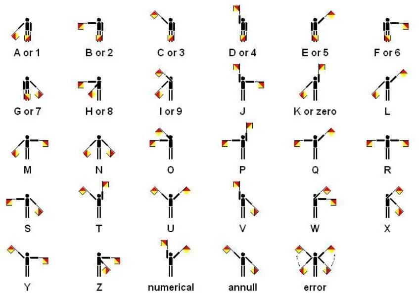

另一种是国际信号旗（international code flags）。这种旗语用不同的旗帜来代表不同的字符。

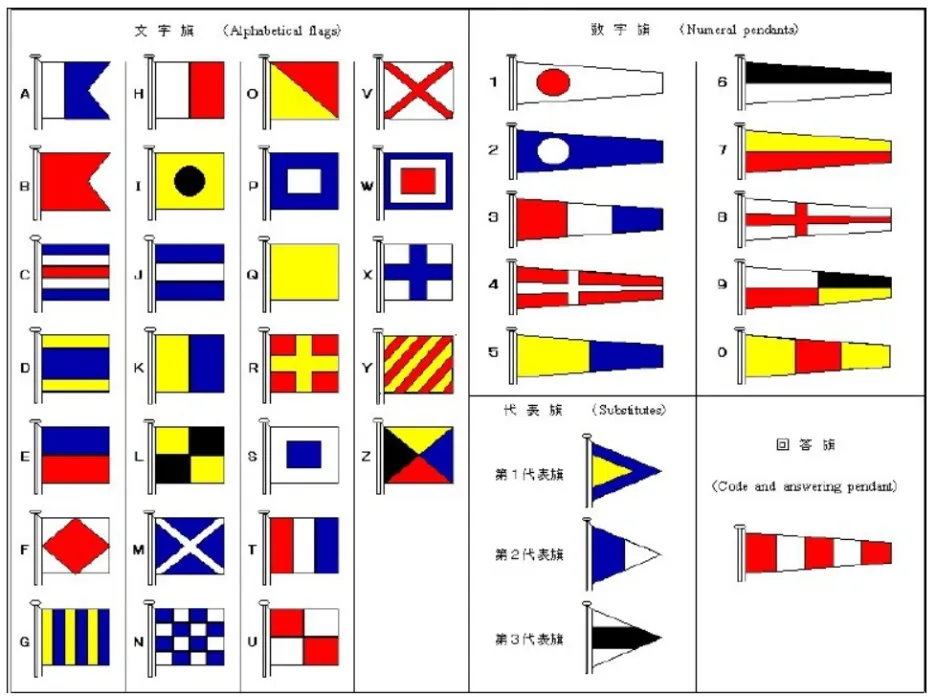

## 埃特巴什码（Atbash Cipher）

非常古老而经典的一种加密方式，其实就是将字母倒过来排。

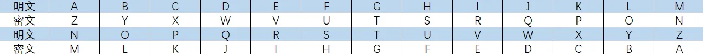

## 凯撒密码（Caesar Cipher）

另一种经典的加密方式。简单来讲就是将所有字母按照字母表顺序向后移动N位，这个N一般需要自行推断，但**在最经典的凯撒密码中，N=3**，如下图所示。

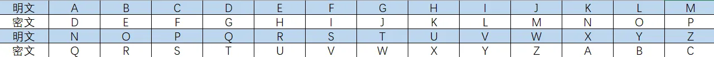

## 仿射变换

相当于是凯撒密码的加强版，不好直接描述，需要引入一些数学语言：

假设明文字母序号为m，密文字母序号为c（此处序号从0开始取，即A对应0，B对应1，依此类推），取定两个整数a、b（a != 0），那么就有 c = ( a * m + b ) % 26 。其中，%代表模运算，即取余数。例如，取明文字母为F（m = 5），a = 7， b = 3，那么就有c = （5 * 7 + 3）% 26 = 38 % 26 = 12，故密文字母为M。

不难发现，凯撒密码就是仿射变换取a = 1时的特例。

## 猪圈密码（Pigpen Cipher）

传闻中共济会使用的密码，有多种变体。最初版本（也是最常见的版本）如下所示：

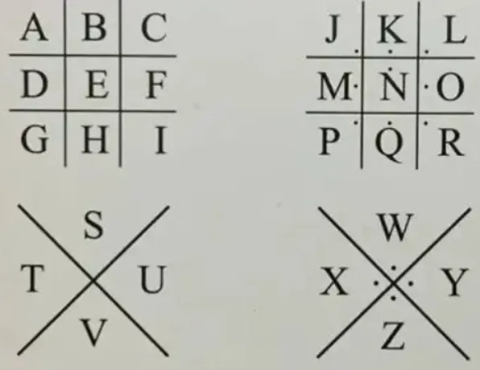

比如，加密hello可以得到：

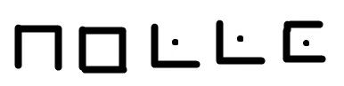

## 培根密码（Bacon's Cipher）

有两种形式，但本质都是将字母按字母表顺序转成二进制。

第一种如下：

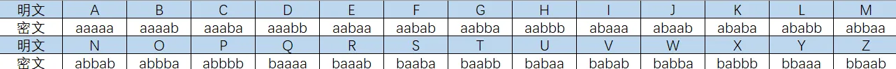

第二种如下（这一种中，I和J对应同一个密文，U和V对应同一个密文）：

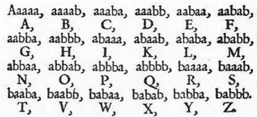

## 波利比奥斯方阵密码（Polybius Square Cipher）

又称棋盘密码。即将26个字母按顺序排布在一个5*5的棋盘中（I和J排在同一格中），使用时将字母转成其所在格子的坐标即可。

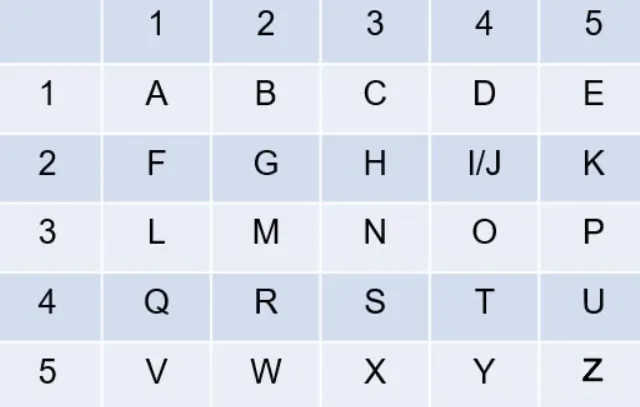

比如，加密hello可以得到 23 15 31 31 34。

## 普雷菲尔密码（Playfair Cipher）

类似于棋盘密码，普雷菲尔密码也需要使用一个5*5的棋盘。不同的是，普雷菲尔需要先选定一个密钥（比如一个英文单词），去除其中重复的字母，然后依序排列在棋盘中，余下的空位按字母序排列。加密时，先将明文每两个字母分为一组，如果组内字母相同，则在其间插入一个X或Q，然后重新分组。分组完成后，按照如下规则提取密文：

+ 如果两个字母在同一行，则取它们右侧下一个字母作为密文（第一列视作最后一列的下一列）；
+ 如果两个字母在同一列，则取它们下侧下一个字母作为密文（第一行石桌最后一行的下一行）；
+ 如果两个字母既不在同一行也不在同一列，则以它们为对角线作矩形，取矩形的另外两端点（具体顺序需要双方事先约定）。

比如，以ucasers为密钥，可以得到如下棋盘（注意最后一个s因为重复被去掉了）：

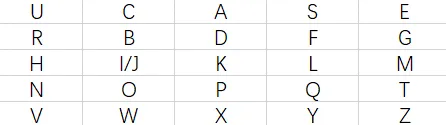

假设明文为yuanshen，那么可以分组为yu an sh en，加密得到VS UP UL UT，即VSUPULUT。假设明文为hello，那么可以分组为he lx lp，加密得到UM KY KQ，即UMKYKQ。

## 单表替换密码

以上种种古典密码，归根结底，都是单表替换密码，即用单一的符号/数字/图片等对字母进行替换。这样的例子还有很多。

破译未知的单表密码时，如果密文文本足够长，可以采用福尔摩斯破译“跳舞的小人”时所使用的频率分析法。英文字母出现的频率不尽相同，比如e和t出现的频率很高，但x和z就很难见到。下表列出了英文字母的出现频率，通过统计文本中字符的出现频率并与下表对照，便可以对破译单表替换密码提供巨大的帮助：

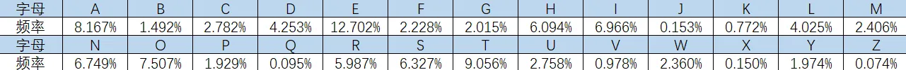

实际操作时，一般不会单独使用频率分析法，而是会与猜词相结合。比如，当你看到一个三元组反复出现了很多次时，这个三元组就很有可能是“the”。

## 维吉尼亚密码（Vigenère Cipher）

维吉尼亚密码需要使用一个密钥来进行加密，使用时将密钥与明文对齐（密钥不够时重复使用），然后查阅下表转成密文：

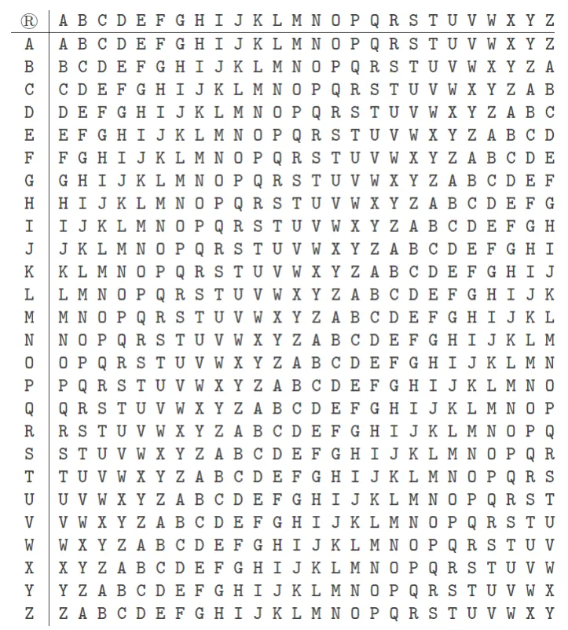

例如，明文为helloworld，密钥为abc 时，加密得到hfnlpyosnd。

## 栅栏密码（Rail-fence Cipher）

加密方式很简单，就是横着把明文写成若干行，然后竖着读出来得到密文。

例如，对于明文helloworld，我们把它写成两行五列，得到：

```
h e l l o
w o r l d
```

竖着读出，得到hweolrllod。