# 二、一次一密（One-Time Pad, OTP）

一次一密是理论上 **绝对安全（Information-Theoretically Secure）** 的加密方案，由Gilbert Vernam在1917年提出。

**原理**：

- 密钥是真随机（**完全均匀随机**）生成的，**长度不小于明文长度**
- **每个密钥只使用一次（永不复用）**
- 使用**异或（XOR）操作**进行加密和解密

加密：`ciphertext = plaintext ^ key`

解密：`plaintext = ciphertext ^ key`

**为什么绝对安全？**
因为对于任意一段密文，都存在一个**同样可能**的密钥，能将其解密为**任意一段**等长的明文。攻击者即使截获了密文，也无法获得关于明文的**任何**信息（除了长度）。

**示例**：
- 明文 `P = "HI"` (0b01001000 01001001)
- 密钥 `K1 = "AB"` (0b01000001 01000010)
- 密文 `C = P ^ K1` = (0b00001001 00001011) = `"\t\v"` (不可见字符)

如果攻击者猜密钥是 `K2 = "OK"` (0b01001111 01001011)，他会解出 `P' = C ^ K2` = (0b00001001 00001011) ^ (0b01001111 01001011) = (0b01000110 00000000) = `"F\0"`。这完全是无意义的。在不知道真正密钥 `K1` 的情况下，所有可能的明文都是等概率的。

**OTP的问题（为什么不常用）**：

1.  **密钥管理**：密钥必须和明文一样长，这导致密钥的生成、分发和存储极为困难。
2.  **真随机**：需要物理上的真随机数生成器。
3.  **密钥复用**：**绝对禁止！** 如果密钥被复用（Two-Time Pad），`C1 = P1 ^ K`, `C2 = P2 ^ K`。那么 `C1 ^ C2 = (P1 ^ K) ^ (P2 ^ K) = P1 ^ P2`。如果P1和P2有统计规律（比如都是英文文本），就很容易被攻破。（频率攻击、**已知明文攻击**）

我们想解决以上问题，于是我们考虑：
- **明文长度总是变化的**
- **我不希望密钥太长（不容易管理）**
- **生成的密钥和真随机生成的随机数无法被区分开**
从而：

> 通过对一次一密的模拟，我们获得了两种类型的对称密码：
> - **流密码（Stream Cipher）**：流式扩展密钥
> - **分组密码（Block Cipher）**：明文按密钥长度分组

## （一）流密码

**核心思想**：使用一个短的**密钥（Key）和一个初始向量（IV/Nonce）**，通过一个**伪随机数生成器 (PRG)**，生成一个任意长的、看起来随机的**密钥流（Keystream）**。然后将其**与明文异或**实现加密。

### 0. 伪随机生成器（Pseudorandom Generator, PRG）

**伪随机生成器 (PRG)**：定义为一个映射：
$$
G: \{0,1\}^\lambda \to \{0,1\}^{p(\lambda)}
$$
其中 $p(\lambda) > \lambda$ (它**扩展**输入)。

对于 PRG，因其伪随机特性，我们要求：一个**PPT（概率多项式图灵机，Probabilistic Polynomial-time Turing Machine）** 区分器 $\mathcal{A}$（相当于**观测者**），无法以**不可忽略**（任意多项式时间）的优势区分 $G(s)$ （其中 $s$ 是随机种子）和一个**等长的真随机字符串（均匀分布采样）** $r$，即：
$$
\left|Pr[\mathcal{A}(G(s)) = 1] - Pr[\mathcal{A}(r) = 1]\right| < \text{negl}(\lambda)
$$

### 1. 线性反馈移位寄存器（Linear Feedback Shift Register, LFSR）

线性反馈移位寄存器是一种生成方式（但是我们一般并不直接使用它，因其强线性性是好解的。**我们往往基于LFSR添加非线性的结构**。）

`Keystream = PRG(Key, IV)`
`Ciphertext = Plaintext ^ Keystream`
`Plaintext = Ciphertext ^ Keystream`

我们这样就模拟了一次一密，但它不是绝对安全的，不过往往是**计算上安全**的，即攻击者（PPT $\mathcal{A}$）在有限时间（多项式时间）内无法攻破。

**线性反馈移位寄存器**是一种经典的（但因其是完全线性的，十分脆弱，现已**不单独使用**）生成密钥流的方式。
```
┌─────────┬─────────┬─────┬─────────┬─────────┐
│ b_{n-1} │ b_{n-2} │ ... │   b_1   │   b_0   │───▶ Output
└─────────┴─────────┴─────┴─────────┴─────────┘
   ▲           │               │         │    
   │        c_{n-2}           c_1       c_0     (c_i=1表示抽头, c_i=0表示不抽)
   └───────────^───────────────^─────────^
```


- **寄存器（Register）**：由 $n$ 个比特位组成的存储单元，保存当前状态 $s_t = (b_{n-1}, b_{n-2}, ..., b_0)$；
- **移位（Shift）**：每运算一个周期，所有位右移一位：$b_i \leftarrow b_{i+1}$，输出最低位 $b_0$；
- **反馈（Feedback）**：通过抽头（tap）选择寄存器中的某些位，**异或**后生成新位填入最高位 $b_{n-1}$；
- **线性（Linear）**：反馈函数是**所选位的线性组合**，即**异或**。

> 理解：**为什么异或是线性的**？
> - 我们在 $\mathbb{F}_2$ （有时也写为 $\text{GF}(2)$）上做运算，其上的异或运算总是满足线性性质。（我们找到了 $\mathbb{F}_2$ 上的两种运算，一种是**异或**，它附着在 $\mathbb{F}_2$ 上时， $\mathbb{F}_2$ 恰构成一个向量空间/线性空间；另一种是**与运算**，它相当于标量乘法。）
> - **线性空间**：加法封闭，数乘封闭，数乘加法分配
> - **线性函数**：
>   - **线性可加性**：$f(x\oplus y) = f(x)\oplus f(y)$
>   - **齐次性**：$c\cdot f(x) = f(c\cdot x)$

数学描述（**特征多项式**）

$$f(x) = 1 + c_1x + c_2x^2 + ... + c_{n-1}x^{n-1} + x^n$$
其中 $c_i \in \{0,1\}$ 表示第 $i$ 位是否为抽头。**这里的加法和乘法（数乘）就分别是异或运算和与运算**。

当这个多项式是 **本原多项式（Primitive Polynomial）** 时，LFSR可以生成最长周期（$2^n - 1$）的序列（**m-序列**）。

$$
\textbf{序列周期} = \textbf{多项式周期}
$$

注：利用**延迟算子**进行推导。

**Python 示例**：
一个简单的4位LFSR，反馈多项式 $f(x) = 1 + x + x^4$ (即 $b_4 = b_1 \oplus b_0$)

```python
from Crypto.Util.number import bytes_to_long

def lfsr(seed, mask):
    """
    LFSR函数
    seed: 当前状态寄存器值
    mask: 反馈多项式掩码，决定哪些位参与反馈计算
    """
    # 寄存器左移1位，空出最低位，并保持24位宽度
    output = (seed << 1) & 0xffffff
    
    # 计算反馈位：seed与mask按位与，得到需要参与反馈计算的位
    i = (seed & mask) & 0xffffff
    
    # 计算所有反馈位的异或（奇偶校验）
    lastbit = 0
    while i != 0:
        lastbit ^= (i & 1)  # 取最低位进行异或
        i = i >> 1          # 右移处理下一位
    
    # 将计算得到的反馈位放入最低位
    output ^= lastbit
    
    return (output, lastbit)

# 初始化：将字符串转换为24位整数作为初始种子
# 注意：字符串会被转换为长整数，但mask是19位，实际使用24位寄存器
R = bytes_to_long(b"flagisflagisFlagIsflagflagFlag")
mask = 0b1010011000100011100  # 19位掩码，对应 1 x^18 + 0 x^17 + 1 x^16 + ... + 0 x^1 + 0 x^0

key = []
for i in range(30):  # 生成30字节的密钥
    tmp = 0
    for j in range(8):  # 每字节8位
        (R, out) = lfsr(R, mask)
        tmp = (tmp << 1) ^ out  # 将输出的位组合成字节
    key.append(tmp)

key = bytes(key)
print(key)
```

多种形式的LFSR写法：

```python
from Crypto.Util.number import bytes_to_long

R, mask = bytes_to_long(b"flagisflagisFlagIsflagflagFlag"), 0b1010011000100011100

### LFSR1 ###
lfsr1 = lambda s, m: (((s << 1) & 0xffffff) | (lb := ((s & m) & 0xffffff).bit_count() & 1), lb)

key = []
for i in range(30):
    tmp = 0
    for j in range(8): tmp, R = (tmp << 1) | lfsr1(R, mask)[1], lfsr1(R, mask)[0]
    key.append(tmp)
print(bytes(key))

### LFSR2 ###
key = bytes([(tmp := 0, [((R := ((R << 1) & 0xffffff) ^ (out := ((R & mask) & 0xffffff).bit_count() & 1)), tmp := (tmp << 1) | out) for _ in range(8)], tmp)[-1] for _ in range(30)])
print(key)

### LFSR3 ###
class lfsr3():
    def __init__(self, init, mask, length):
        self.init = init
        self.mask = mask
        self.lengthmask = 2**(length+1) - 1

    def next(self):
        nextdata = (self.init << 1) & self.lengthmask 
        i = self.init & self.mask & self.lengthmask 
        output = 0
        while i != 0:
            output ^= (i & 1)
            i = i >> 1
        nextdata ^= output
        self.init = nextdata
        return output

print(bin(lfsr3(R, mask, 48).init))
```

### 2 LFSR的矩阵描述

LFSR因其**线性性**可以用**状态转移矩阵**来进行描述。

#### 2.1 状态向量 (State Vector)
我们将LFSR在 $t$ 时刻的 $n$ 位寄存器状态表示为一个 $n$ 维向量 $S_t$。
为了方便矩阵运算，我们通常将其表示为**列向量**：
$$
S_t = \begin{pmatrix} b_{n-1} \\ b_{n-2} \\ \vdots \\ b_0 \end{pmatrix}
$$

#### 2.2. 转移矩阵 (Transition Matrix)
我们的目标是找到一个 $n \times n$ 的矩阵 $M$，使得 $S_{t+1} = M \cdot S_t$。
这个矩阵 $M$ 必须执行两个操作：

1.  **移位寄存**：将 $b_i$ 移动到 $b_{i-1}$ 的位置（$b_{n-2} \leftarrow b_{n-1}, b_{n-3} \leftarrow b_{n-2}, \dots$）。
2.  **反馈**：根据反馈多项式 $f(x) = 1 + c_1x + \dots + c_{n-1}x^{n-1} + x^n$ ，这是一个**线性多项式**。注意：这里的 $c_i$ 对应 $b_{n-i}$ 的抽头）计算新位 $b_{n-1}'$。
    - $b_{n-1}' = c_1 b_{n-1} \oplus c_2 b_{n-2} \oplus \dots \oplus c_n b_0$
    - 注意：多项式 $1 + x + x^4$ 对应 $b_3' = b_0 \oplus b_3$，而不是 $b_0 \oplus b_1$。为与后面我们定义的伴随矩阵一致，我们使用 $b_{n-1}' = \sum_{i=0}^{n-1} c_i b_i$ 的形式，其中 $c_i$ 是反馈系数。

让我们使用一个标准形式，其特征多项式为 $f(x) = x^n + c_{n-1}x^{n-1} + \dots + c_1x + c_0$。
$S_{t+1}$ 的状态如下：

- $b_{n-1}' = c_{n-1}b_{n-1} \oplus c_{n-2}b_{n-2} \oplus \dots \oplus c_0 b_0$
- $b_{n-2}' = b_{n-1}$
- $b_{n-3}' = b_{n-2}$
- ...
- $b_0' = b_1$

这可以写成矩阵形式 $S_{t+1} = M \cdot S_t$：
$$\begin{pmatrix} b_{n-1}' \\ b_{n-2}' \\ \vdots \\ b_1' \\ b_0' \end{pmatrix} = \begin{pmatrix} c_{n-1} & c_{n-2} & \dots & c_1 & c_0 \\ 1 & 0 & \dots & 0 & 0 \\ 0 & 1 & \dots & 0 & 0 \\ \vdots & \vdots & \ddots & \vdots & \vdots \\ 0 & 0 & \dots & 1 & 0 \end{pmatrix} \begin{pmatrix} b_{n-1} \\ b_{n-2} \\ \vdots \\ b_1 \\ b_0 \end{pmatrix}$$
这个矩阵 $M$ 被称为特征多项式 $f(x)$ 的**伴随矩阵 (Companion Matrix)**。

#### 2.3. 矩阵描述
从 $S_{t+1} = M \cdot S_t$ 出发，我们可以得到：

- $S_1 = M \cdot S_0$
- $S_2 = M \cdot S_1 = M \cdot (M \cdot S_0) = M^2 \cdot S_0$
- ...
- **$S_k = M^k \cdot S_0$**


#### 2.4. LFSR系数的恢复

在 LFSR 的分析中，一个核心问题是：**给定一个由 LFSR 生成的序列，我们能否反推出这个 LFSR 的结构？** 具体来说，就是找到能生成该序列的**最短**线性反馈移位寄存器及其对应的**特征多项式（反馈多项式）**。

考虑一个 $L$ 阶的 LFSR（长度为 $L$），其**所有**输出都遵循一个**唯一的线性递推关系**：

$$
b_{n} = c_{1} \cdot b_{n-1} \oplus c_{2} \cdot b_{n-2} \oplus \dots \oplus c_{L} \cdot b_{n-L}
$$

我们的**任务**就是：**给定序列 $\underline{s}$，找到 $L$ 和 $c_1, \dots, c_L$。**

##### 2.4.1 建立线性方程组

我们有 $L$ 个未知的系数 ($c_1, \dots, c_L$)。我们可以利用已知的输出序列 $\underline{s}$ 来写出$L$个方程：

$$
\begin{cases}
s_L = c_1 s_{L-1} \oplus c_2 s_{L-2} \oplus \dots \oplus c_L s_0\\
s_{L+1} = c_1 s_L \oplus c_2 s_{L-1} \oplus \dots \oplus c_L s_1\\
s_{L+2} = c_1 s_{L+1} \oplus c_2 s_L \oplus \dots \oplus c_L s_2\\
\cdots\\
s_{2L-1} = c_1 s_{2L-2} \oplus c_2 s_{2L-3} \oplus \dots \oplus c_L s_{L-1}
\end{cases}
$$

这构成了一个 $L \times L$ 的线性方程组。

把上述方程组写成矩阵形式：

$$
    \begin{pmatrix}
    s_{L-1} & s_{L-2} & \dots & s_0 \\
    s_L & s_{L-1} & \dots & s_1 \\
    s_{L+1} & s_L & \dots & s_2 \\
    \vdots & \vdots & \ddots & \vdots \\
    s_{2L-2} & s_{2L-3} & \dots & s_{L-1}
    \end{pmatrix}\cdot\begin{pmatrix}
    c_1 \\ c_2 \\ c_3 \\ \vdots \\ c_L
    \end{pmatrix}
    =\begin{pmatrix}
    s_L \\ s_{L+1} \\ s_{L+2} \\ \vdots \\ s_{2L-1}
    \end{pmatrix}
$$

即抽象为了 $A \cdot x = b$。

* **$A$**：由**已知序列**构成的 $L \times L$ 矩阵 (**汉克尔矩阵 Hankel Matrix**)。
* **$x$**：我们**未知**的 $L$ 个**系数向量**。
* **$b$**：由**已知序列**的“未来”值构成的 $L \times 1$ 向量。

##### 2.4.2 求解参数 $x$

只要矩阵 $A$ 在 $GF(2)$ 上是**可逆**的（即**行列式** $\det(A) \not\equiv 0 \pmod 2$），我们就可以解出 $x$：

$$
x = A^{-1} \cdot b
$$

（这里的 $A^{-1}$ 是 $A$ 在 $GF(2)$ 上的模逆矩阵）。

可能的问题：
1. 不知道 $L$：从小到大**遍历 $L$**（$L=1, 2, 3, \dots$），观察何时 $\det(A) = 1$（矩阵可逆），说明我们**第一次**找到了一个可解的、唯一的系统。这个 $L$ 就是我们要找的**最小阶数（线性复杂度）**。
2. 已知的 $\underline{s}$ 序列长度不够：对未知位置的比特进行**枚举**。

补充内容：Berlekamp-Massey (BM) 算法，非线性结构与相关攻击/代数攻击。


#### 1.3 线性同余生成器（Linear Congruential Generator, LCG）

LFSR 是一种 PRG。在CTF中，我们还会遇到另一种**极其不安全**（但很常见）的PRG。LCG是早期 `rand()` 函数（如C标准库）的常见实现。

**原理**：
通过一个简单的线性递推公式生成序列：
$$
X_{n+1} = (a \cdot X_n + c) \pmod{m}
$$

- $X_0$ 是**种子 (Seed)**
- $m$ 是**模数 (Modulus)**
- $a$ 是**乘数 (Multiplier)**
- $c$ 是**增量 (Increment)**

LCG的安全性**几乎为零**。它的问题在于其**强线性**（在整数环 $\mathbb{Z}_m$ 上）。
**攻击**：如果你能观测到**连续3个**输出值 $X_1, X_2, X_3$，你就可以（大概率）破解出 $a$ 和 $c$。

1.  $X_1 = (a X_0 + c) \pmod m$
2.  $X_2 = (a X_1 + c) \pmod m$
3.  $X_3 = (a X_2 + c) \pmod m$

做差消去 $c$：
- $X_2 - X_1 \equiv a (X_1 - X_0) \pmod m$
- $X_3 - X_2 \equiv a (X_2 - X_1) \pmod m$

令 $Y_i = X_{i+1} - X_i$：
- $Y_1 \equiv a Y_0 \pmod m$
- $Y_2 \equiv a Y_1 \pmod m$

我们有两个未知数 $a$ 和 $m$（通常 $m$ 是未知的）。
从 $Y_2 \equiv a Y_1 \pmod m$ 和 $Y_1 \equiv a Y_0 \pmod m$，我们可以推导出：
$$
Y_2 \cdot Y_0 \equiv a Y_1 Y_0 \equiv Y_1 \cdot (a Y_0) \equiv Y_1 \cdot Y_1 \equiv Y_1^2 \pmod m
$$
所以：
$$
Y_2 Y_0 - Y_1^2 \equiv 0 \pmod m
$$
这意味着 $m$ 必须是 $Y_2 Y_0 - Y_1^2$ 的因子。（$T_n = X_{n+2}X_n - X_{n+1}^2$）

**更简单的攻击**：
如果你能观测到 $X_1, X_2, X_3$ 并且**已知 $m$**（例如 $m=2^{32}$）：
- $Y_1 = X_2 - X_1$
- $Y_0 = X_1 - X_0$
- $a = Y_1 \cdot (Y_0^{-1}) \pmod m$ (使用 `inverse(Y0, m)` 或者 `pow(Y0, -1, m)` 计算模逆)
- 一旦求出 $a$， $c = (X_1 - a X_0) \pmod m$

一旦 $a, c, m$ 已知，你就**可以预测（解释）所有未来（过去）的随机数**。

**Python 示例**：

```python
# LCG 参数 (glibc)
m = 2**31
a = 1103515245
c = 12345
seed = 42

def lcg(state): return (a * state + c) % m

# 生成几个值
states = [seed]
for _ in range(5): states.append(lcg(states[-1]))

print(f"LCG outputs: {states}")
# [42, 463997853, 194326509, 1195156676, 1282210247, 1025114758]

# --- 攻击者视角 ---
# 假设我们只知道 m，并截获了3个连续输出
m = 2**31
X1, X2, X3 = 194326509, 1195156676, 1282210247

Y1 = (X2 - X1) % m
Y2 = (X3 - X2) % m

# a = Y2 * (Y1^-1) mod m
inv_Y1 = gmpy2.invert(Y1, m)
if inv_Y1 is None: print("Attack failed: Y1 has no inverse mod m")
else:
    cracked_a = (Y2 * inv_Y1) % m
    
    # c = X2 - a*X1 mod m
    cracked_c = (X2 - cracked_a * X1) % m
    
    print(f"\nCracked a: {cracked_a} (Original: {a})")
    print(f"Cracked c: {cracked_c} (Original: {c})")
    
    # 预测下一个值
    predicted_X4 = (cracked_a * X3 + cracked_c) % m
    print(f"Predicted X4: {predicted_X4}")
    print(f"Actual X4:    {lcg(X3)}")
    assert predicted_X4 == lcg(X3)
```

## （二）分组密码

**核心思想**：将明文分成**固定长度的块（Block）**，然后使用密钥对每个块进行独立的加密/解密。

- **块大小（Block Size）**：如 64位（DES）, 128位（AES）
- **密钥（Key）**：决定了加密的具体置换方式
- **填充（Padding）**：如果明文不是块大小的整数倍，必须先进行填充（如 PKCS\#7）。

### 1. AES（Advanced Encryption Standard）简单介绍

- **当前最常用**的分组密码标准。
- **块大小**：固定为 **128 位** (16 字节)。
- **密钥长度**：可选 **128位** (10轮)、**192位** (12轮) 或 **256位** (14轮)。
- **结构**：**SPN (Substitution-Permutation Network)**。
- **加密过程**：由多轮（Rounds）组成，每轮包含4个步骤：
    1.  **SubBytes（字节替换）**：通过一个非线性的S-Box进行替换，抵抗线性分析。
    2.  **ShiftRows（行移位）**：按行进行循环移位，提供扩散性。
    3.  **MixColumns（列混淆）**：对每列进行矩阵乘法（在 $GF(2^8)$ 上），提供扩散性。
    4.  **AddRoundKey（轮密钥加）**：将当前块与扩展后的轮密钥进行异或。

> 在CTF中，你通常不需要自己实现AES，而是需要理解它的**属性**和**工作模式**。

**Python 示例**：
使用 `pycryptodome` 进行AES加密（注意：需要处理填充）。

```python
from Crypto.Cipher import AES
from Crypto.Util.Padding import pad, unpad
from Crypto.Random import get_random_bytes

# 密钥必须是 16 (AES-128), 24 (AES-192) 或 32 (AES-256) 字节
key = get_random_bytes(16)
data = b'This is some secret message.'

print(f"Original data: {data}")

# --- AES 加密 ---
# 1. 创建一个 AES cipher 对象 (ECB 模式)
cipher_ecb = AES.new(key, AES.MODE_ECB)

# 2. 填充明文到 16 字节的倍数
padded_data = pad(data, AES.block_size)
print(f"Padded data: {padded_data}")

# 3. 加密
ciphertext = cipher_ecb.encrypt(padded_data)
print(f"Ciphertext (ECB): {ciphertext.hex()}")

# --- AES 解密 ---
# 1. 创建一个解密器
decipher_ecb = AES.new(key, AES.MODE_ECB)

# 2. 解密
decrypted_padded_data = decipher_ecb.decrypt(ciphertext)

# 3. 去除填充
decrypted_data = unpad(decrypted_padded_data, AES.block_size)
print(f"Decrypted data: {decrypted_data}")

assert data == decrypted_data
```

### 2. 分组密码的工作模式（Mode of Operation）

**问题**：如何使用块大小为16字节的AES，去加密一个1000字节长的文件？
**答案**：使用工作模式。

不同的工作模式在**安全性**（是否隐藏模式）、**效率**（是否可并行）、**容错性**（一位错误影响多大）和**功能**（是否需要随机访问、是否提供认证）上有巨大差异。

> **注意：** ECB, CBC 模式需要**填充 (Padding)** 来使明文达到块大小的整数倍。而 CFB, OFB, CTR, GCM 模式本质上是**流密码**，**不需要填充**。

```
需要认证加密（AEAD）？ (即同时保证机密性和完整性)
    ├─ 是 → 选择 AES-256-GCM（硬件加速）或 ChaCha20-Poly1305（软件）
    └─ 否 → (不推荐，但如果必须...) 需要随机访问？
       ├─ 是 → CTR模式（文件系统、磁盘加密）
       └─ 否 → 需要隐藏明文模式？(即相同明文块加密后不同)
          ├─ 是 → CBC模式（但务必配合MAC使用，否则易受攻击）
          └─ 否 → ECB模式（极不安全，仅用于随机数据，如密钥封装）
```

#### (1) ECB (Electronic Codebook) 电子密码本模式

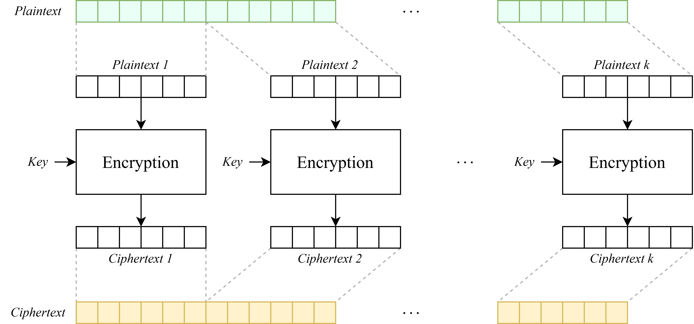
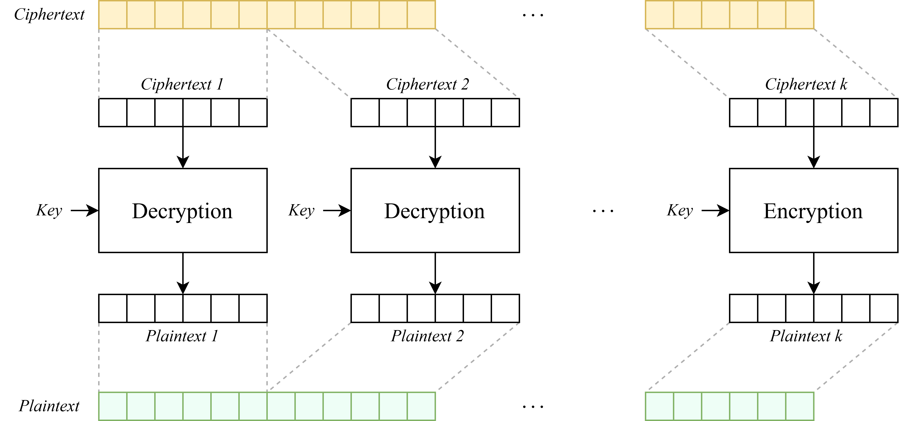

* **原理**：最简单的模式。每个明文块 $P_i$ 独立地加密成密文块 $C_i$。
    * 加密: $C_i = E_k(P_i)$
    * 解密: $P_i = D_k(C_i)$
* **优点**：
    * 简单，易于实现。
    * **可并行计算**：可以同时加密或解密所有块。
    * **容错性高**：一个密文块出错，只影响对应的明文块。
* **缺点**：
    * **极不安全！** 相同的明文块 ($P_i = P_j$) 会产生相同的密文块 ($C_i = C_j$)。这会暴露明文的统计规律和模式，如 **The ECB Penguin**：
    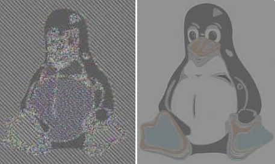
* **用途**：**严禁用于加密消息。** 仅适用于加密**完全随机**的数据（如加密另一个密钥）。

**Python 实现**：
```python
from Crypto.Cipher import AES
from Crypto.Util.Padding import pad, unpad
import os

key = os.urandom(16)
data = b'A'*16 + b'B'*16 + b'A'*16 # 重复的明文
print(f"Original: {data}")

# --- ECB 加密 ---
cipher_ecb = AES.new(key, AES.MODE_ECB)
padded_data = pad(data, AES.block_size)
ct_ecb = cipher_ecb.encrypt(padded_data)
print(f"ECB Hex:  {ct_ecb.hex()}")
# 观察：第一块密文 (ct_ecb[0:16]) 和第三块 (ct_ecb[32:48]) 完全相同
assert ct_ecb[0:16] == ct_ecb[32:48]

# --- ECB 解密 ---
decipher_ecb = AES.new(key, AES.MODE_ECB)
pt_padded = decipher_ecb.decrypt(ct_ecb)
pt = unpad(pt_padded, AES.block_size)
print(f"Decrypted: {pt}")
assert data == pt
```

#### (2) CBC (Cipher Block Chaining) 密码块链接模式

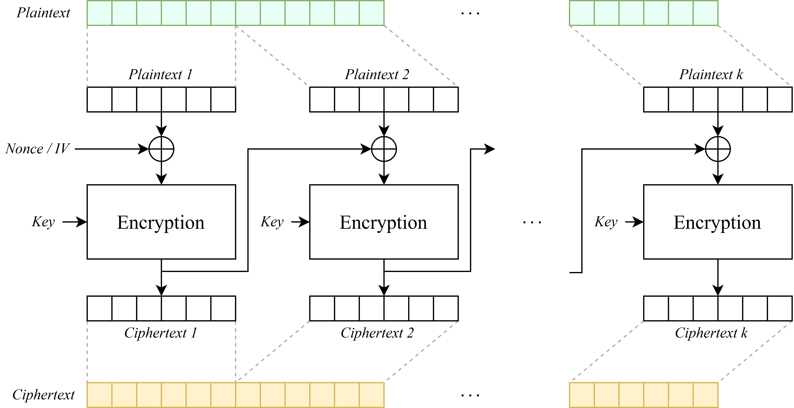
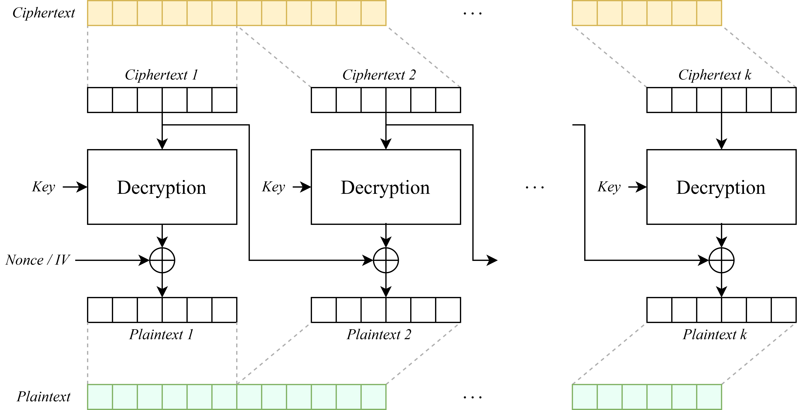

* **原理**：加密前，当前明文块 $P_i$ 先与**前一个密文块** $C_{i-1}$ 异或。
    * **IV (Initialization Vector)**：对于第一个块，需要一个**随机且唯一**的 $C_{-1}$，称为**初始向量 (IV)**。IV 无需保密，但**必须随机**。
    * 加密: $C_i = E_k(P_i \oplus C_{i-1})$ (其中 $C_{-1} = IV$)
    * 解密: $P_i = D_k(C_i) \oplus C_{i-1}$
* **优点**：
    * **隐藏明文模式**：相同的明文块会产生不同的密文块（雪崩效应）。
    * **解密可并行**：解密 $P_i$ 只需要 $C_i$ 和 $C_{i-1}$。
* **缺点**：
    * **加密是串行**的（必须等 $C_{i-1}$ 出来才能算 $C_i$）。
    * **容错性低**：$C_i$ 中一位错误会损坏 $P_i$ 整个块，并导致 $P_{i+1}$ 中对应位出错。
    * 易受**Padding Oracle Attack (填充谕言攻击)**，必须配合**认证**（如 HMAC）使用（Encrypt-then-MAC）。

**Python 实现**：
```python
iv_cbc = os.urandom(16) # IV 必须随机
data = b'A'*16 + b'B'*16 + b'A'*16 # 同样的数据

# --- CBC 加密 ---
cipher_cbc = AES.new(key, AES.MODE_CBC, iv_cbc)
padded_data = pad(data, AES.block_size)
ct_cbc = cipher_cbc.encrypt(padded_data)
print(f"\nCBC Hex:  {ct_cbc.hex()}")
# 观察：第一块和第三块密文不同
assert ct_cbc[0:16] != ct_cbc[32:48]

# --- CBC 解密 ---
# 解密时必须使用相同的 IV
decipher_cbc = AES.new(key, AES.MODE_CBC, iv_cbc)
pt_padded_cbc = decipher_cbc.decrypt(ct_cbc)
pt_cbc = unpad(pt_padded_cbc, AES.block_size)
print(f"Decrypted: {pt_cbc}")
assert data == pt_cbc
```

#### (3) CFB (Cipher Feedback) 密码反馈模式

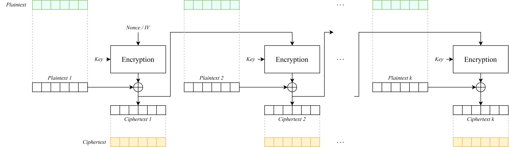
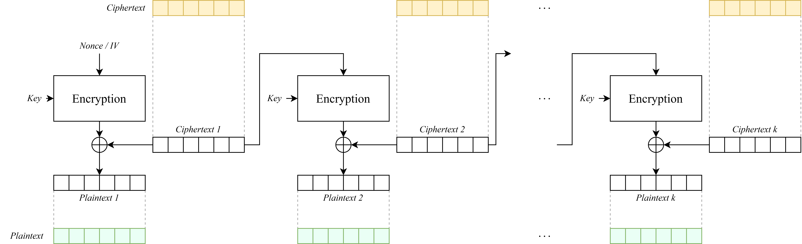

* **原理**：将分组密码转换为**自同步流密码**。
    * **IV/Nonce**：需要一个随机的 IV。
    * 加密: $C_i = P_i \oplus E_k(C_{i-1})$ (其中 $C_{-1} = IV$)
    * 解密: $P_i = C_i \oplus E_k(C_{i-1})$
    * 注意：解密时仍然使用**加密函数 $E_k$**！
* **优点**：
    * **流密码**：无需填充，可以加密任意长度（如1字节）的数据。
    * **解密可并行**（如果 $C_{i-1}$ 已知）。
* **缺点**：
    * 加密是串行的。
    * 错误传播：$C_i$ 中一位错误会损坏 $P_i$ 对应位，并损坏 $P_{i+1}$ 整个块。

**Python 实现**：
```python
iv_cfb = os.urandom(16)
data = b'This is a secret message, not aligned to 16 bytes.'

# --- CFB 加密 ---
# 注意：CFB模式下，加密和解密都用 AES.new(...)
cipher_cfb = AES.new(key, AES.MODE_CFB, iv_cfb)
ct_cfb = cipher_cfb.encrypt(data)
print(f"\nCFB Hex:  {ct_cfb.hex()}")

# --- CFB 解密 ---
# 解密时必须使用相同的 IV
decipher_cfb = AES.new(key, AES.MODE_CFB, iv_cfb)
pt_cfb = decipher_cfb.decrypt(ct_cfb)
print(f"Decrypted: {pt_cfb}")
assert data == pt_cfb
```

#### (4) OFB (Output Feedback) 输出反馈模式

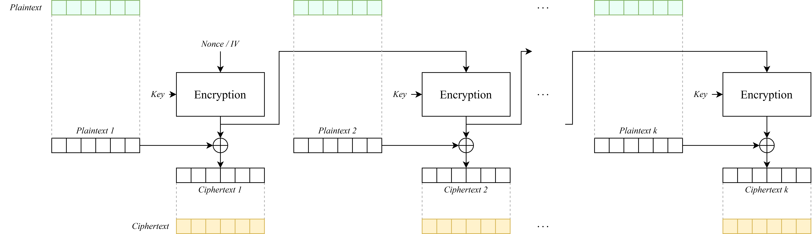
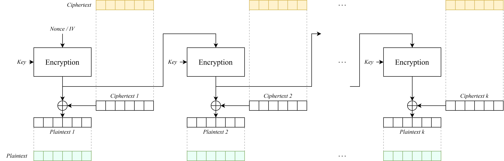

* **原理**：将分组密码转换为**同步流密码**（类似CTR）。
    * **IV/Nonce**：需要一个**唯一 (Unique)** 的 IV（也叫 Nonce）。
    * 生成密钥流: $O_i = E_k(O_{i-1})$ (其中 $O_{-1} = IV$)
    * 加密: $C_i = P_i \oplus O_i$
    * 解密: $P_i = C_i \oplus O_i$
* **优点**：
    * **流密码**：无需填充。
    * **密钥流可以预先计算**。
    * **无错误传播**：密文中的位错误只影响明文对应位（流密码特性）。
* **缺点**：
    * **IV/Nonce 绝不能重复使用！** 如果IV重复（$IV_1 = IV_2$），则密钥流 $O$ 会完全相同，导致 `C1 ^ C2 = P1 ^ P2`（同OTP密钥复用）。
    * 加密和解密都是串行的（在生成密钥流时）。
* **Python 实现**：
```python
iv_ofb = os.urandom(16) # Nonce: 必须唯一
data = b'Another secret message.'

# --- OFB 加密 ---
cipher_ofb = AES.new(key, AES.MODE_OFB, iv_ofb)
ct_ofb = cipher_ofb.encrypt(data)
print(f"\nOFB Hex:  {ct_ofb.hex()}")

# --- OFB 解密 ---
# 解密时必须使用相同的 IV
decipher_ofb = AES.new(key, AES.MODE_OFB, iv_ofb)
pt_ofb = decipher_ofb.decrypt(ct_ofb)
print(f"Decrypted: {pt_ofb}")
assert data == pt_ofb
```

#### (3) CTR (Counter) 计数器模式

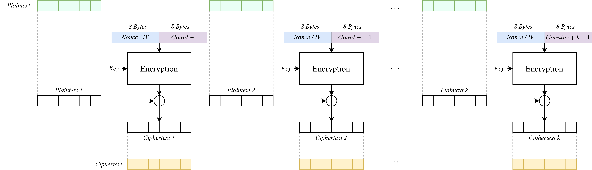
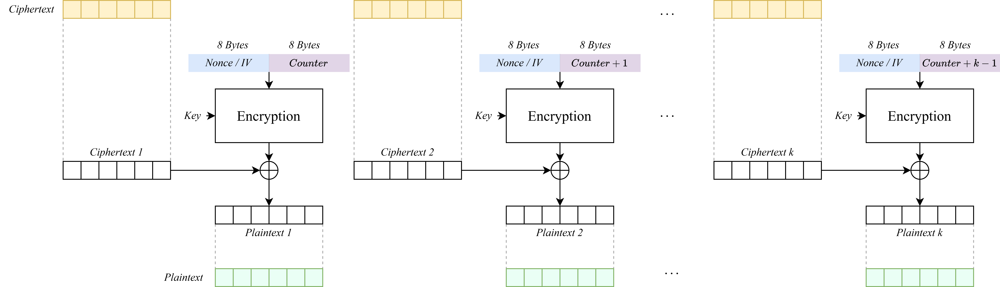

* **原理**：将分组密码转换为**同步流密码**，是目前最常用、最高效的模式之一。加密一个由 **Nonce（只用一次的随机数）**和**计数器（Counter, $i$）** 组成的块，将其输出作为密钥流，与明文 $P_i$ 异或。
    * **Nonce**：需要一个**唯一 (Unique)** 的随机数。
    * 生成密钥流: $O_i = E_k(\text{Nonce} + i)$ (Nonce 和 计数器 $i$ 组合)
    * 加密: $C_i = P_i \oplus O_i$
    * 解密: $P_i = C_i \oplus O_i$
* **优点**：
    * **完全可并行**：$O_i$ 的计算只依赖 $i$，与 $O_{i-1}$ 无关。
    * **可随机访问**：可以立即解密文件的第 $i$ 块，无需解密前面的块。
    * 无需填充，无错误传播。
* **缺点**：
    * **Nonce 绝不能重复使用！**（与OFB同理）

**Python 实现**：
```python
# CTR 模式的 Nonce 通常比块大小短，如 8 字节，剩下 8 字节用于计数器
nonce_ctr = os.urandom(8) 
data = b'The quick brown fox jumps over the lazy dog.'

# --- CTR 加密 ---
# pycryptodome 会自动处理计数器
cipher_ctr = AES.new(key, AES.MODE_CTR, nonce=nonce_ctr)
ct_ctr = cipher_ctr.encrypt(data)
print(f"\nCTR Hex:  {ct_ctr.hex()}")

# --- CTR 解密 ---
# 解密时必须使用相同的 Nonce
# 必须创建一个新的 cipher 对象
decipher_ctr = AES.new(key, AES.MODE_CTR, nonce=nonce_ctr)
pt_ctr = decipher_ctr.decrypt(ct_ctr)
print(f"Decrypted: {pt_ctr}")
assert data == pt_ctr
```

#### (4) GCM (Galois/Counter Mode)

* **原理**：**AEAD (Authenticated Encryption with Associated Data)**。它结合了 CTR 模式（用于加密）和 GHASH（一种在伽罗瓦域 $GF(2^{128})$ 上的哈希，用于认证）。
* **功能**：同时提供**机密性**（Confidentiality）、**完整性**（Integrity）和**认证**（Authenticity）。
* **流程**：
    1.  使用 CTR 模式加密明文 $P$。
    2.  计算 $P$、$A$（Associated Data，关联数据，如报头，只认证不加密）和 $C$ 的 GHASH。
    3.  将 GHASH 的结果加密（用 $E_k(\text{Nonce}+0)$）生成**认证标签 (Tag)**。
* **优点**：
    * **一站式安全**：解决了 CBC + HMAC 的复杂性。
    * 高效、可并行（基于CTR）。
    * 同时提供**机密性**（来自CTR）、**完整性**和**认证**（来自GHASH）。
    * 是 TLS 1.3、SSH 等现代协议的**首选模式**。
* **缺点**：
    * **Nonce 绝不能重复使用！** 复用 Nonce 不仅会像 CTR 一样泄露明文，还会**彻底摧毁认证密钥**，导致伪造攻击。
* **Python 实现**：
```python
nonce_gcm = os.urandom(12) # GCM 推荐 12 字节 (96位) Nonce
data = b'This data must be confidential and authentic.'
header = b'This is public metadata.' # 关联数据 (AAD)

# --- GCM 加密与认证 ---
cipher_gcm = AES.new(key, AES.MODE_GCM, nonce=nonce_gcm)
cipher_gcm.update(header) # 1. 传入AAD
ct_gcm, tag = cipher_gcm.encrypt_and_digest(data) # 2. 加密并生成Tag

print(f"\nGCM Ciphertext: {ct_gcm.hex()}")
print(f"GCM Tag:        {tag.hex()}")
print(f"GCM Nonce:      {nonce_gcm.hex()}")

# --- GCM 解密与验证 ---
# 攻击者如果篡改了密文或AAD...
# ct_gcm_tampered = ct_gcm[:-1] + b'A' # 篡改密文
# header_tampered = b'This is tampered metadata' # 篡改AAD

try:
    decipher_gcm = AES.new(key, AES.MODE_GCM, nonce=nonce_gcm)
    decipher_gcm.update(header) # 1. 传入 *完全相同* 的AAD
    pt_gcm = decipher_gcm.decrypt_and_verify(ct_gcm, tag) # 2. 解密并验证Tag

    print(f"Decrypted: {pt_gcm.decode()}")
    print("GCM Verification: SUCCESS")
    assert data == pt_gcm
    
except (ValueError, KeyError) as e:
    print(f"\nDecryption FAILED: {e}")
    print("GCM Verification: FAILED! (Data or AAD was tampered)")
```

### 3. 分组密码的设计结构

分组密码不是随意设计的，它们通常遵循几种成熟的迭代结构，通过多轮简单的操作来达到高安全性。

#### (1) SPN (Substitution-Permutation Network) 替换-置换网络

* **代表**：**AES (Rijndael)**
* **结构**：在每一轮中，对**整个数据块**执行两个主要操作：
    1.  **替换 (Substitution)**：使用**S-Box**（S盒）进行非线性替换。这是抵抗线性密码分析和差分密码分析的关键。
    2.  **置换 (Permutation)**：使用**P-Box**（P盒）或等效操作（如 AES 中的 `ShiftRows` 和 `MixColumns`）来打乱数据位，实现**扩散 (Diffusion)**，即明文的一位变化会影响到密文的多位。
* **流程**：`AddRoundKey` $\rightarrow$ `S-Box` $\rightarrow$ `P-Box` $\rightarrow$ `AddRoundKey` $\rightarrow$ ...
* **概念实现**：
```python
# 极简化的SPN
S_BOX = {0: 0xE, 1: 0x4, ..., 0xF: 0x1} # 非线性替换
P_BOX = [0, 4, 8, 12, 1, 5, 9, 13, 2, 6, 10, 14, 3, 7, 11, 15] # 位置换

def spn_round(state, round_key):
    # 1. 密钥加（通常是异或）
    state = state ^ round_key
    # 2. 替换 (S-Box)
    new_state = 0
    for i in range(4): # 假设16位块, 4个4位的S-Box
        nibble = (state >> (i*4)) & 0xF
        new_state |= (S_BOX[nibble] << (i*4))
    state = new_state
    # 3. 置换 (P-Box)
    new_state = 0
    for i in range(16):
        if (state >> i) & 1:
            new_state |= (1 << P_BOX[i])
    state = new_state
    return state
```

#### (2) Feistel 结构

* **代表**：**DES**, 3DES, Camellia
* **结构**：将数据块（$n$ 位）分成左右两半，$L_i$ 和 $R_i$（各 $n/2$ 位）。
* **轮函数 $F$**：每轮只对**一半**的数据进行操作。
    * $L_{i+1} = R_i$
    * $R_{i+1} = L_i \oplus F(R_i, K_i)$
* **核心优势**：**解密算法和加密算法完全相同**，只需将轮密钥 $K_i$ 逆序使用即可。这是因为 $L_i = R_{i+1} \oplus F(R_i, K_i) = R_{i+1} \oplus F(L_{i+1}, K_i)$。
* **概念实现**：
```python
# 极简化的Feistel轮函数
def F_func(half_block, key):
    # 轮函数F不必可逆，可以是任意复杂操作
    return (half_block * 3 + key) & 0xFFFF # 假设16位

def feistel_encrypt_round(L, R, key):
    L_next = R
    R_next = L ^ F_func(R, key)
    return L_next, R_next

def feistel_decrypt_round(L_next, R_next, key):
    R = L_next
    L = R_next ^ F_func(L_next, key) # F(R, K) == F(L_next, K)
    return L, R

# 示例: 32位块, 16位轮密钥
L0, R0 = 0xABCD, 0x1234
K1 = 0x5678

L1, R1 = feistel_encrypt_round(L0, R0, K1)
print(f"加密后: L1=0x{L1:X}, R1=0x{R1:X}")

L_back, R_back = feistel_decrypt_round(L1, R1, K1)
print(f"解密后: L=0x{L_back:X}, R=0x{R_back:X}")
assert (L_back, R_back) == (L0, R0)
```

#### (3) ARX 结构 (Add-Rotate-XOR)

* **代表**：**ChaCha20**, Salsa20, BLAKE (Hash)
* **结构**：不使用 S-Box 或 P-Box，而是仅依赖三种在现代 CPU 上极快的操作：
    1.  **Add**：模 $2^{32}$ 或 $2^{64}$ 加法（提供了非线性）。
    2.  **Rotate**：按常数 $k$ 进行循环移位（`x <<< k` 或 `x >>> k`，提供了扩散）。
    3.  **XOR**：异或（提供了非线性）。
* **优势**：在软件中实现非常高效，且能有效抵抗时序攻击（Timing Attack），因为它不依赖查表（S-Box）。
* **概念实现**：
```python
# ChaCha20的Quarter-Round (QR) 概念
# (在 32-bit 整数上操作)
def rotl(x, k):
    # 32位循环左移
    return ((x << k) | (x >> (32 - k))) & 0xFFFFFFFF

def arx_quarter_round(a, b, c, d):
    a = (a + b) & 0xFFFFFFFF; d = rotl(d ^ a, 16)
    c = (c + d) & 0xFFFFFFFF; b = rotl(b ^ c, 12)
    a = (a + b) & 0xFFFFFFFF; d = rotl(d ^ a, 8)
    c = (c + d) & 0xFFFFFFFF; b = rotl(b ^ c, 7)
    return a, b, c, d
```

#### (4) Lai-Massey 结构

* **代表**：**IDEA**
* **结构**：Feistel 结构的变体，提供了更快的扩散性。
* **流程**：$L$ 和 $R$ 在每一轮都会被修改，且会用到 $L_i \oplus R_i$ 的值。
    * $T = F(L_i \oplus R_i, K_i)$
    * $L_{i+1} = L_i \oplus T$
    * $R_{i+1} = R_i \oplus T$
* **优势**：与 Feistel 类似，加密和解密结构相似。
