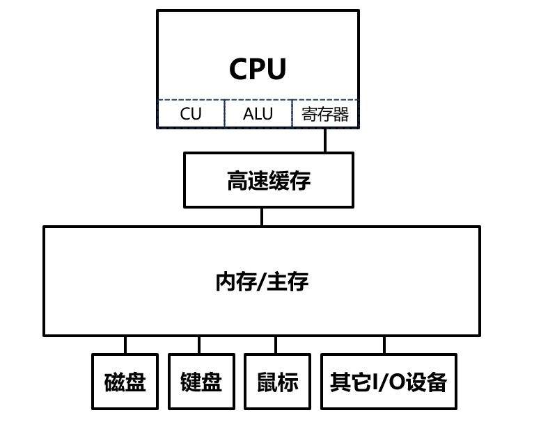

# 扩展：计算机的基本组成结构

Author: [doyo](https://github.com/doyo2024)

&emsp;&emsp;简单而言，现在通用计算机的结构可以概括为以下几个部分： 

* **计算器**
* **控制器**
* **存储器**
* **I/O设备**

&emsp;&emsp;其中，计算器和控制器（以及部分存储器）共同组成了**CPU(Central Processing Unit, 中央处理单元)**。此外，计算机的各个部件之间（无论是在CPU内部还是CPU外部）通过**总线(bus)**进行连接。

&emsp;&emsp;一台计算机的基本组成如下图所示：

## CPU

&emsp;&emsp;一个典型的CPU基本包含以下一些结构：

* **寄存器（register）**：寄存器本质上是一种存储器，详见下文存储器部分。
* **控制单元（control unit，CU）**：控制各个器件正常工作。
* **算术逻辑单元（arithmetic logic unit，ALU）**：执行各种算术运算和逻辑运算。
* **时钟（clock）**：对CPU内部操作与系统其它组件进行同步。
* **内部总线（internal bus，IB）**：连接上述各个部件，用于在它们之间传输信息。

&emsp;&emsp;CPU是计算机的大脑，它能理解由一串串0和1组成的机器指令，通过控制单元生成相关的控制信号，从相关的存储器中取出数据，并控制算数算术逻辑单元完成相应的运算，再把结果放在指定的存储器中。

## 存储器

&emsp;&emsp;要使CPU正常工作，必须向它提供指令和数据，而指令和数据被存放于存储器中。

&emsp;&emsp;存储器的容量是以**字节（Byte）**为最小单位的，比如一个拥有128个存储单元（编号从0~127）的存储器可以存储128个字节的信息。1个二进制位对应1个bit，而8个bit组成一个Byte，因此，一个存储器单元就可以存储28种不同的状态。当然，对于更大的容量，我们也会使用KB（1KB=1024B）、MB（1MB=1024KB）乃至GB（1GB=1024MB）、TB（1TB=1024GB）。

&emsp;&emsp;现在的存储器体系通常分为四层，目前只需要对寄存器和内存有一个粗浅的认识即可。下文列出了这四层：（从前到后，读写速度越来越慢，造价越来越低，数量也越来越高）

### 寄存器（Register）

&emsp;&emsp;如果你没有预先学过《数字电路》课程，那么你可以暂时将寄存器当成一个能够在指令执行时存入/取出信息的容器。从寄存器中存入和取出信息的过程非常迅速，几乎可以认为是瞬间完成的。寄存器的作用就类似于我们在C语言等高级语言中使用的变量（但二者本质上是有区别的）。

### 高速缓存（Cache）

&emsp;&emsp;高速缓存用来加速内存数据的读写。对于CPU而言，它是透明的（transparent，即CPU不知道高速缓存的存在）。我们暂时不讨论高速缓存，如果你对它感兴趣，可以参考一下《计算机组成与结构》相关的课程。

### 内存/主存（Main Memory）

&emsp;&emsp;它们其实是同一概念的两个名字。

&emsp;&emsp;任何要让计算机执行的指令以及要处理的数据，都必须先放在内存中，然后才能传送给CPU。内存虽然不在CPU内，但它与CPU都位于主机中。CPU可以直接与内存进行交互，而不必经过I/O设备。对于本系列的学习，你可以粗浅地认为内存是一中具有一定大小、可以通过地址迅速访问其中某一指定单元的存储器。它就像是我们在高级语言中使用的数组那样（但二者本质上也是有区别的）。

&emsp;&emsp;关于内存的具体管理方式，详见《计算机组成与结构》和《操作系统》课程。

### 磁盘（disk）等外设

&emsp;&emsp;内存的容量是极其有限的。我使用的这台电脑有16GB的内存，最新款的电脑能有32GB的内存。但这仍然不够。为了存储海量的数据，我们不得不使用磁盘等外部设备。它们存储的数据和指令不能直接为CPU所用，而是必须先通过I/O设备送入内存。

## 总线

&emsp;&emsp;CPU若要进行数据的读写，必须进行以下三类信息的交互：

* **地址信息**：存储单元的地址，即数据被储存在什么位置
* **控制信息**：读或写的命令
* **数据信息**：读或写的数据
  
&emsp;&emsp;这些信息通过**总线（bus，导线的集合，因为这些信息本质上而言都是电信号）**进行传输，而（外部）总线从逻辑上分为**地址总线（address bus，AB）**、**控制总线(control bus，CB)**、**数据总线(data bus，DB)**和**I/O总线**。前三种与内存的读写操作有关，I/O总线主要用于在CPU和系统输入／输出设备之间传输数据。

&emsp;&emsp;当我们要从内存中读取数据时，CPU先通过地址总线发出地址信息，然后通过控制总线发出内存读命令，然后存储器通过数据总线将对应存储单元内的数据送入CPU。

&emsp;&emsp;向内存写入数据的操作类似，CPU先通过地址线发出地址信息，然后通过控制线发出内存写命令，然后通过数据线将要写入的数据送入内存中对应的存储单元中。

&emsp;&emsp;我们如何评判总线的数据传输能力呢？这与总线的宽度有关，亦即一根总线中包含了多少根导线。我们知道，在现有的电子计算机中，一根导线可以稳定地传送高电平和低电平两种状态，也就是一个bit位，那么，一根宽度为N的总线一次就可以传输N个bit的信息。比如，8086CPU中的数据总线宽度为16，一次就可以传输两个字节的信息。

&emsp;&emsp;一台电子计算机中有多个物理存储器，它们都通过总线与CPU相连。不过在CPU看来，它们都被视作一个逻辑存储器（内存地址空间），而每个物理存储器在这个逻辑存储器中占有一个地址段，亦即一段地址空间。对这一地址空间进行数据的读写就等价于对相应的物理存储器进行读写操作。内存地址空间的大小受CPU地址总线宽度限制，如8086CPU地址总线宽度为20 ，其内存空间大小就为1MB。

&emsp;&emsp;除此之外，前文还提到了一种特殊的**内部总线**，它主要用于在CPU内部进行信息的传输（这个信息可以是地址，也可以是数据）。
