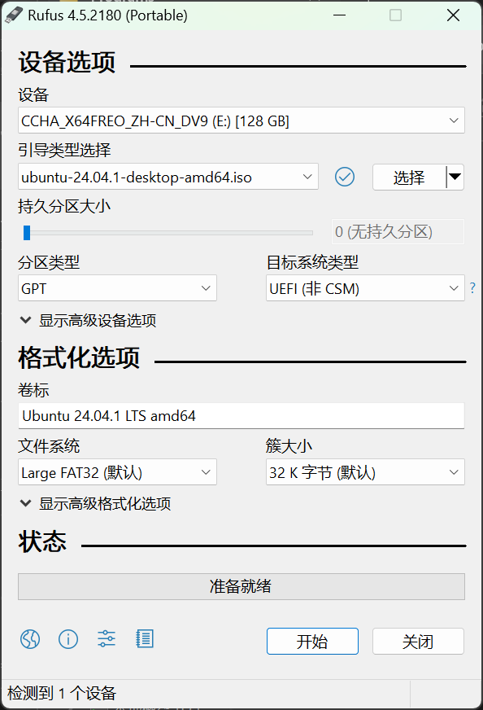
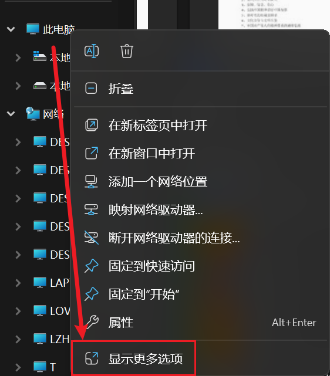

# 安装单系统/多系统Linux

## 说在前面

本文是一篇个人向的配置教程，以帮助想配置 Linux 的同学搭建一个可以日常使用的、比较适合新手的 Linux 双系统环境（Ubuntu + kde + zsh）。

**为什么是单/双系统？** 除了运行流畅、稳定、性能良好这类有点自欺欺人的优点以外，Linux 已经有足够日常使用的软件：QQ、微信、IDA、网易云等，生态已经比前几年好太多了；此外（至少 Ubuntu，在开发环境上）相对 Windows 感觉少了许多对新手来说难以排查、摸不着头脑 Bug；Linux 可以高度的自定义，十分的美观；对新手来说，许多设置已经可以通过 UI 来完成了。

**教程不清楚/好像哪里不对？** 直接找我（Crazy_13754）就好了。

**和网上的教程有什么区别？** 或许更多的是对网上的教程的一个总结。

**前置条件？** 只会 Win 下的双系统安装，并且保证如果你仍想保留 Win，请先保证 Win 的正常运行，因为 Win 默认清理覆盖全部引导项。

**缺点？** Linux 没什么游戏且没有 MS Office，因此双系统会是更佳选择；如果需要频繁切换系统，开关机似乎也很烦人。

首先下载 [Ubuntu LTS 24.04](https://cn.ubuntu.com/download) 。下载这个较大的版本往往可以解决一些驱动上的问题。

你仍需要完成以下三件准备工作

1. 关闭安全启动。你的电脑在启动时按特定键可以进入 BIOS 设置，这取决你的电脑品牌、主板型号等（自行[必应](https://cn.bing.com/)搜 XX 电脑如何进入 BIOS）。在其设置中找到安全启动（Secure Boot）并关闭它。
   安全启动是 UEFI BIOS 的一个子规则，旨在防止恶意软件侵入。它要求所有加载的模块必须签名，否则会拒绝启动。预装 Win8/10/11 的系统要求开启 Secure Boot，而 Win7 则不支持。消费者可根据需要选择开启或关闭，但安装 Win11 需在线更新功能时必须开启。
   通常它是有用的，但会阻止我们安装 Ubuntu。

2. 找到一个 U 盘，下一个 [Rufus](https://rufus.ie/downloads/)。后缀字母 p 的意义是便携的 portable，即给你一个不用安装的可执行文件，正常选带 p 的就可以了。
   打开后，设备选择你的 U 盘（会格式化清理上面的所有文件，请备份 U 盘上面的文件！）。
   镜像选择下好的镜像文件。
   分区类型，正常来说，应该改为 UEFI。
   文件系统应该不用改。
   点开始即可。
   
3. （准备使用双系统的话）为 Linux 准备足够空间。
   1. 可以右键文件管理器的此电脑，点击显示更多选项——管理（G）；
   
   打开的界面左侧选择存储——磁盘管理，在想分区的地方点压缩卷分配 70-150 G 空间（空间足够的话当然越大越好）；
   
   
   2. 或者下载一个[图吧工具箱](https://www.tbtool.cn/)，安好后在磁盘工具中找到 Disk Genius 并操作。
   

然后重启，并在启动时按特定键进入启动盘选择自行[必应](https://cn.bing.com/)搜 XX 电脑如何选择启动盘）。选择你的 U 盘，它上面应该标注了 Ubuntu。

成功进入安装程序后，根据引导安装即可。（此处需要补图！）

安装类型需要选其他选项（自已创建、调整分区、或者为 Ubuntu 选择多个分区），找到你分的那块地方，挂载点选择为主分区、Ext4、挂载点为 / 即可（通常有教程让分多个分区，但个人认为没有必要）。
当然，你可以分几十个 G 给交换空间，但个人认为这也是没必要的。交换空间（Swap Space）是一种磁盘上的特殊空间，用于扩展系统的虚拟内存。当系统的物理内存（RAM）使用量达到其最大容量时，Linux内核会使用交换空间来临时存储那些暂时不活跃的进程，从而为其他进程腾出内存空间。交换空间的作用类似于虚拟内存，但它是存储在磁盘上的，而不是在物理内存中。个人电脑的内存通常很难用完，不过没有交换空间将会只能睡眠，不能休眠。

安装即可，安装完成后，应该会有 Please remove the installation medium, then press ENTER(请拔掉安装介质，然后按下 ENTER)的提示。再次启动应该就有系统选择界面了。

Ubuntu 安装至此完成，下面讲各种配置。
