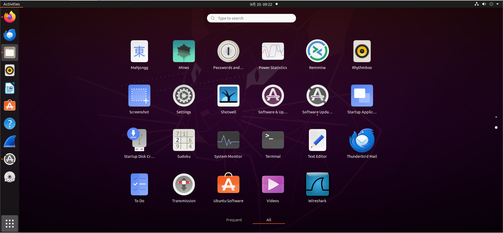

# 虚拟机及C语言环境配置相关问题的解答

Author: [doyo](https://github.com/doyo2024)

## 物理机相关

**Q:** 我怎么知道我的电脑是什么架构？

**A:** 最简单直接的方法，看你电脑的牌子。如果是苹果的，那就是arm架构；苹果之外的其它牌子，比如惠普、戴尔、联想、华为等等，基本上都是x86-64的。

## 虚拟机配置相关

**Q:** 我怎么知道我的虚拟机装好了吗？

**A:** 虚拟机安装的最后一步会重启虚拟机，之后会出现登录界面。输入你设置的密码，如果能进入桌面，那就是已经安装成功。

**Q:** vmtools是什么？我怎么安装它？

**A:** 这个工具主要用来进行物理机和虚拟机之间的文件复制，以及处理一些网络问题，它并不是必须的。如果你想要安装它，可以参考一下这篇博客：

[【Tools】Ubuntu22.04安装VMware Tools详解(基于VMware 17)](https://blog.csdn.net/dengjin20104042056/article/details/131737193)

**Q:** SSH是什么？

**A:** SSH即安全外壳协议（Secure SHell），可以用来远程访问你的虚拟机。SSH属于使用虚拟机的进阶技巧，现阶段不要求掌握，对之后的培训也不会产生任何影响。如果你希望学习SSH的使用，可以参考以下两个链接：

[Ubuntu 22.04安装并启用OpenSSH](https://cn.linux-console.net/?p=14853)

[VsCode使用ssh连接Ubuntu（并实现免密连接）](https://blog.csdn.net/qq_47771099/article/details/134477508)


## 虚拟机使用相关

**Q:** 我怎么打开终端？

**A:** 有两个方法。

**第一种方法：** 在左侧边栏寻找一个叫terminal（这就是终端的英文）的应用，如果左侧边栏没有，点击左下角九个点的图标，在All里面寻找，就像下面这样：



这种方法打开的终端位于根目录下（~）。

**第二种方法：** 第二种方法，在你当前的目录下（比如桌面或某个文件夹里）单击右键，选中“Open in Terminal”选项。这种方法打开的终端位于你当前目录。

**Q:** 怎么新建文件？

**A:** 在当前目录下打开终端，键入以下指令：

```shell
touch 文件名
```

**Q:** 我的字太小了！

**A:** 在侧边栏找到一个叫settings（设置）的应用（图标像一个齿轮），找到Displays（显示），调整一下分辨率（Resolution）或者画面大小即可。

**Q:** 我在使用SSH登录虚拟机时出现connection timeout该怎么办？

**A:** 首先，检查一下是否连上了网络、网络是否通畅。

如果网络没有问题，检查虚拟机是否开启了SSH服务。在虚拟机中打开终端，执行一下指令查看sshd状态：

```shell
systemctl status sshd
```

如果发现sshd没有开启，执行下述指令开启sshd之后应该就可以正常登录了：

```shell
systemctl restart sshd
```

如果sshd已经开启，检查一下虚拟SSH的配置是否有误。在虚拟机中打开终端，执行下述指令：

```shell
sudo gedit /etc/ssh/sshd_config
```

这条指令会在记事本中打开sshd_config这个文件，其中有SSH相关的配置信息。找到其中带有“Port”的一行，检查“Port”之后的数字是否是22。这个数值代表SSH目前使用的端口号，22是SSH默认的端口号。如果不是的话，把它改成22之后（记得修改后保存文件）再尝试连接。

## C语言环境相关

**Q:** 我怎么在虚拟机中安装VsCode？

**A:** 可以参考一下这篇博客：[ubuntu22.04安装vscode](https://blog.csdn.net/iiloveChina/article/details/139294306)

**Q:** gcc是什么？我怎么知道我有没有安装它？

**A:** gcc是一种常用的C语言编译器。计算机并不能理解我们编写的C语言代码，它只能理解由一串串0和1构成的机器指令。编译器就是帮我们把人可以理解的C语言代码转换成计算机能理解的指令的工具。

打开一个终端，执行指令`gcc -v`。这条指令用于查看gcc的版本，如果在输出中看到`gcc version`字样，说明已经安装成功。如果没有安装，执行下面这条指令安装即可：

```shell
sudo apt install gcc
```

**Q:** 我怎么在虚拟机中运行我写好的C代码？

**A:** 如上一问所述，计算机无法直接理解我们写好的C代码，所以我们无法直接运行写好的C代码，而是需要先进行编译，然后运行编译得到的二进制应用程序。

假设我们写好了一份名为hello.c的代码，我们**在当前目录下打开终端**，执行下述指令进行编译：

```shell
gcc hello.c -o hello
```

这条指令表示我们用gcc工具编译hello.c，并将编译结果写入一个名叫hello的文件中。这个hello文件不需要手动创建，它是gcc运行时自动生成的。-o是一个编译选项，它用于指定存放编译结果的文件。如果不添加-o选项，编译结果将被写入一个默认的文件中（一般文件名是a.out）。

上面这条指令跑完后，如果你编写的代码没有问题，那么可以在当前目录下看到一个名为hello的文件，这就说明编译成功了。然后在同一终端中执行下面这条指令来运行它：

```shell
./hello
```

在Linux中（我们使用的Ubuntu虚拟机使用的是一种Linux操作系统），运行一个程序的方法是指明访问它的路径，就像上面这条指令这样。./表示的是当前目录，所以这条指令的意思是“运行当前目录下名字叫hello的程序”。

## 其它

**Q:** 我可以不使用虚拟机吗？

**A:** 完全可以。我们推荐使用虚拟机，主要是为了给大家提供一个方便好用的C语言环境。如果你有其它配置好、可以熟练使用的C语言环境，比如VsCode、DevCpp、Visual Studio等，那也是可以的。
