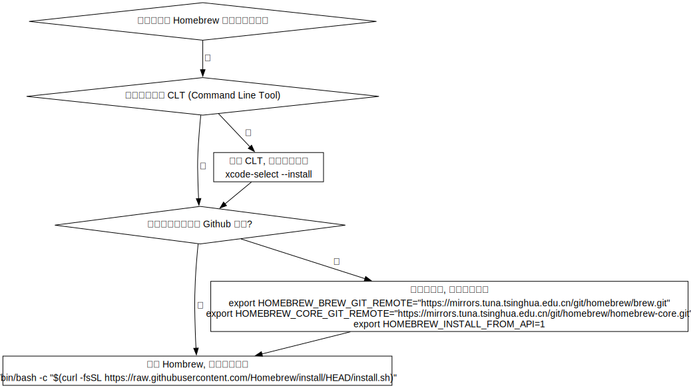
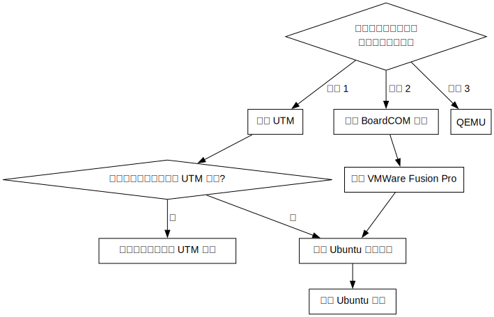

# 在 macOS 上配置环境

Author: [凉凉](https://github.com/li-yiyang)

对于使用 macOS 的同学, 你可以参考 [macOS 上的坑和一些 tips](https://ucaskernel.com/d/775-macos-tips/) 这个 Kernel 的帖子来进行一些环境的配置.

本文包含两个部分:
+ [Homebrew 配置](#Homebrew-配置)
+ [虚拟机的配置](#虚拟机的配置)

## Homebrew 配置


你需要一个 macOS 上的包管理器 [^1], 这里建议使用 [Homebrew](https://brew.sh) 来作为包管理器.

[^1]: 你可以将包管理简单理解为一个命令行版本的软件商店. ([Package manager Wikipedia](https://en.wikipedia.org/wiki/Package_manager))

### 安装 CLT (Command Line Tools for Xcode, 命令行工具)
需要有较好的网络连接以从 Apple 的网站上下载对应的文件. 其中包括一些比较常用的开发工具.

```shell
xcode-select --install
```

### 安装 Homebrew
+ 你 **有** 稳定快速的 Github 连接 ([官网](https://brew.sh))

  ```shell
  /bin/bash -c "$(curl -fsSL https://raw.githubusercontent.com/Homebrew/install/HEAD/install.sh)"
  ```
+ 你 **没有** 稳定快速的 Github 连接 ([清华源](https://mirrors.tuna.tsinghua.edu.cn/help/homebrew/))

  在运行官网脚本之前请设置对应的环境变量 ([PATH (Wikipedia)](https://en.wikipedia.org/wiki/PATH_(variable))) [^2].

  ```shell
  export HOMEBREW_BREW_GIT_REMOTE="https://mirrors.tuna.tsinghua.edu.cn/git/homebrew/brew.git"
  export HOMEBREW_CORE_GIT_REMOTE="https://mirrors.tuna.tsinghua.edu.cn/git/homebrew/homebrew-core.git"
  export HOMEBREW_INSTALL_FROM_API=1

  /bin/bash -c "$(curl -fsSL https://github.com/Homebrew/install/raw/master/install.sh)"
  ```

[^2]: 所谓的环境变量, 可以理解为在 Shell 这个交互式程序 (REPL) 执行过程中的变量. 其中 `export` 的关键词用于将该变量名字在该 Shell 进程中设为 "全局" 的变量. 你可以通过 `$HOMEBREW_BREW_GIT_REMOTE` 的方式 (前缀 `$`) 来引用变量的值.

### Homebrew 的日常使用
+ 下载包

  ```shell
  brew install <包的名称>
  ```
+ 更新包

  ```shell
  brew upgrade <包的名称>
  ```
+ 移除包

  ```shell
  brew uninstall <包的名称>
  ```
+ 更多请自行阅读 `man brew` 或者 `brew help`.

## 虚拟机的配置


### UTM 方案
1. 从 [官网](https://mac.getutm.app) 下载 `.dmg` 镜像包 ([下载链接](https://github.com/utmapp/UTM/releases/latest/download/UTM.dmg)), 双击打开 (挂载), 将 `UTM.app` 移动到 `Application` (应用程序) 文件夹中;
2. 运行 UTM 程序:
   + 你懒得自己安装:

     选择 `游览 UTM 库` (Browse UTM Gallery) 或直接访问 [Gallery](https://mac.getutm.app/gallery/) 选择一个镜像并点击 `Open in UTM`, 等待下载完毕即可;
   + 你想要自己安装:

     确保你手上有 Linux 发行版的镜像 (通常为 `.iso` 文件)
	 1. 选择 `创建一个新虚拟机` (Create a New Virtual Machine);
	 2. 对于 M 系列芯片 (ARM 架构) 的 mac 电脑, 如果想要使用 Virtualize 模式, 请使用 **ARM 架构** 的镜像, 否则请使用 Emulate 模式;
	 3. 选择 Linux, Boot ISO Image 中选择你的发行版镜像, 剩下的配置看自己电脑的富裕程度;
3. 设置好虚拟机后点击 "播放" 形状的按钮即可运行.

### VWware Fusion Pro 方案
1. 注册一个 BroadCOM (VWware 现在的母公司) 的账号: [BroadCOM Support](https://support.broadcom.com/) (选择 Register);
2. 用注册的账号去下载 [VMware Fusion Pro](https://support.broadcom.com/group/ecx/productdownloads?subfamily=VMware%20Fusion);
3. 创建虚拟机, 然后添加 ISO 镜像, 然后配置虚拟机的资源, 最后安装.

### QEMU 方案
1. 安装 QEMU:

   ```shell
   brew install qemu
   ```
2. 选择一个文件夹或者你想要存放文件的路径:

   ```shell
   # 设置全局环境变量
   export LINUX_VM="~/ctf/linux-vm/"

   # 创建对应的文件夹
   mkdir -pv $LINUX_VM

   # 切换到对应的文件夹
   cd $LINUX_VM
   ```
3. 创建一个虚拟磁盘, 大小 (`LINUX_VM_SIZE`) 随便分配

   ```shell
   # 虚拟磁盘名称
   export LINUX_VM_DISK=$LINUX_VM/linux.qcow2
   export LINUX_VM_SIZE=8G

   # 创建镜像
   qemu-img create -f qcow2 $LINUX_VM_DISK $LINUX_VM_SIZE
   ```
4. 挂载安装镜像 `.iso` 并运行虚拟机:

   ```shell
   # 设置虚拟机的内存占用 (MB)
   export LINUX_VM_RAM=1024
   export LINUX_ISO=/path/to/your/linux/iso/image

   # x86-64 架构
   qemu-system-x86_64 \
	   -m $LINUX_VM_RAM \
	   -cdrom $LINUX_ISO \
	   $LINUX_VM_DISK
   ```

   更多参数请参考文档 [QEMU User Documentation](https://www.qemu.org/docs/master/system/qemu-manpage.html).

## 编辑器的配置
+ [配置你的 Emacs](https://ucaskernel.com/d/830-emacs/)
